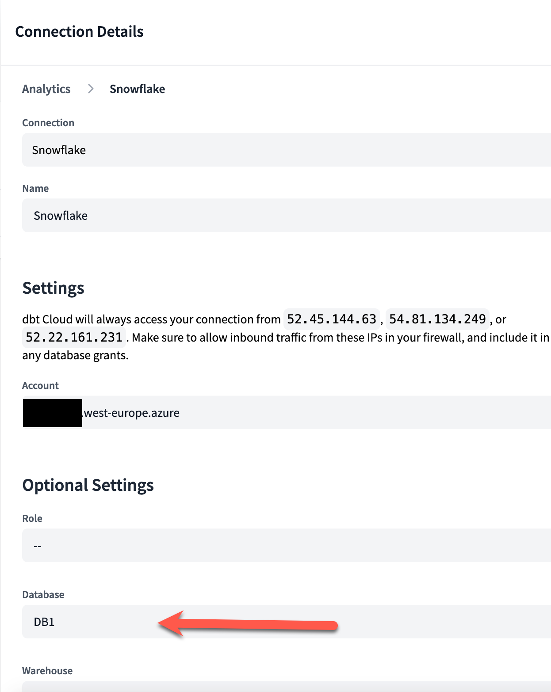

# Motivation

I wanted to learn more about XTS (Extended tracking satellites) in Datavault 2.0. I found this blog <https://www.snowflake.com/blog/out-of-sequence-data/> where it explains that if you have out of sequence data you will need the support of an XTS, and I wanted to try this by my self.

## What you need

- A Snowflake account (there are 30 days trials). You can also use any other product supported by DBT / dvautomate.
- A dbt free account. (It's free for one developer, you need an email that is NOT gmail, hotmail, etc.)

### In snowflake

- Create a database called DB1 (Nothing else needed here DBT will create the Datavault objects here) (The command is create database db1;)
- From xxxx copy all the commands in a Snowflake worksheet and execute those. This will create a table (Customer) that will emulate our source system.

### In DBT cloud

1. Create a project, I called it Analytics, and then setup a connection to the database DB1 in Snowflake


2. Create a job, with the following commands:

```python
dbt seed
dbt build
```

3. This REPO is a DBT project, make sure to have this REPO as your project source in DBT cloud.


