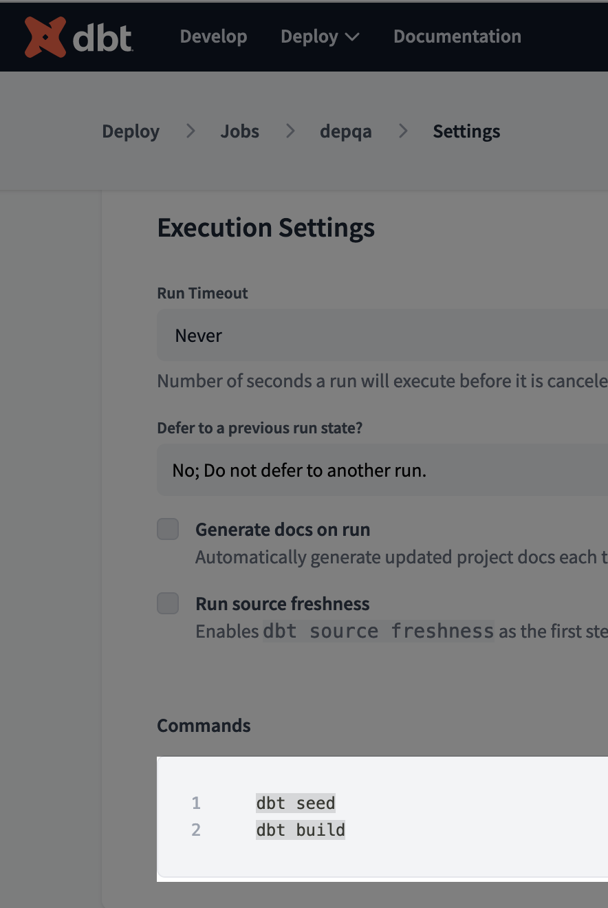
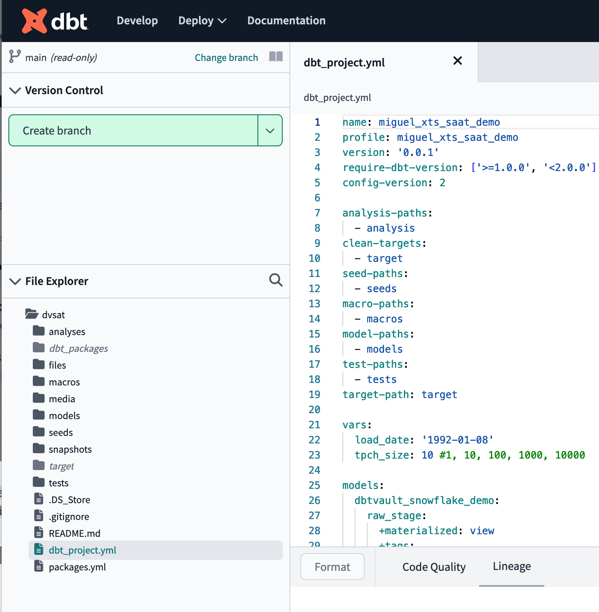
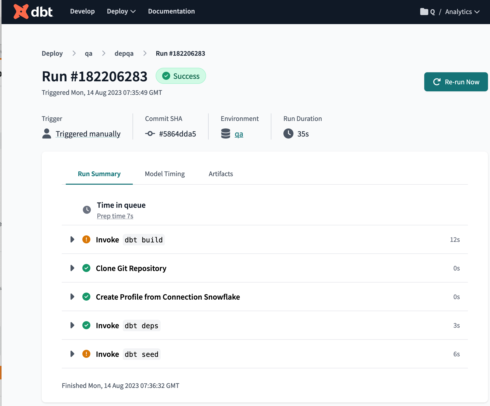
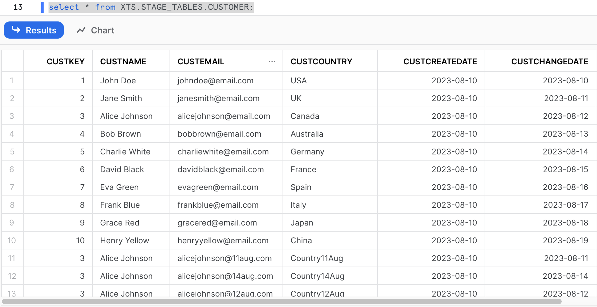
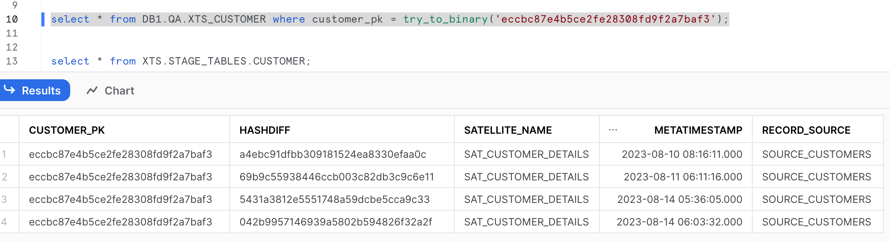
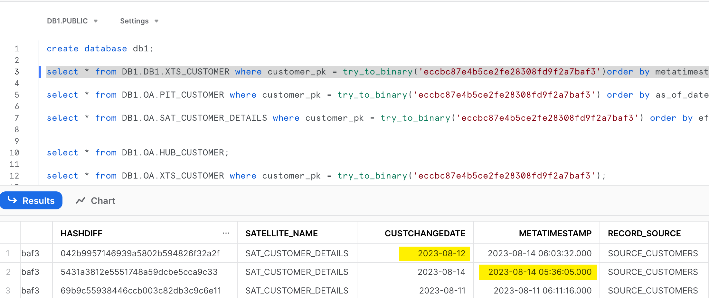

# Motivation

I wanted to learn more about XTS (Extended tracking satellites) in Datavault 2.0. I found this blog <https://www.snowflake.com/blog/out-of-sequence-data/> where it explains that if you have out of sequence data you will need the support of an XTS, and I wanted to try this by my self.

Warning: Instructions for each of the tools are not very detailed you will need to google a bit ;).

I chose to use DBT and <https://github.com/Datavault-UK/automate-dv> because both are available for free, feel free to contribute other tools.

Feel free to contribute, open issues, etc.

## What you need

- A Snowflake account (there are 30 days trials). You can also use any other product supported by DBT / dvautomate.
- A dbt free account. (It's free for one developer, you need an email that is NOT gmail, hotmail, etc.)

### In snowflake

- Create a database called DB1 (Nothing else needed, DBT will create the Datavault objects here) (The command is create database db1;)
- From [here](files/snowflake_slq_commands/create_artifacts.sql) copy all the commands in a Snowflake worksheet and execute those. This will create a table (Customer) that will emulate our source system.

### In DBT cloud

1. Create a project, I called it Analytics, and then setup a connection to the database DB1 in Snowflake


2. Create a job, with the following commands:

```python
dbt seed
dbt build
```


3. This REPO is a DBT project, make sure to have this REPO as your project source in DBT cloud.


### Load some sample data to snowflake

#### Copy the files to the stage

Using Snowflake CLI or the UI copy the files from the folder files (in this repo) (all the files with .csv extension) to the stage.

Then load those files to Snowflake with the following command:

```sql
use database XTS;
copy into STAGE_TABLES.CUSTOMER from
    (select cast($1 as number),
    $2,
    $3,
    $4,
    to_date($5, 'AUTO'),
    to_date($6,'AUTO'), 
    metadata$filename, 
    METADATA$FILE_LAST_MODIFIED
    from '@"XTS"."PUBLIC"."XTSSTAGE"/customers_initial_load.csv') 
FILE_FORMAT = (FORMAT_NAME = STAGE_TABLES.CSVFORMAT)
Force=True;
```

Note: you can replace in the from '@"XTS"."PUBLIC"."XTSSTAGE" the name of the file.

### Trigger the job in DBT

The job we created earlier now is the time to run it.



## Datavault Objects

Start examining [dbt_project.yml](dbt_project.yml) 

There you will see that in the folder [models](/models/) there are definition of multiple Datavault objects. 

Remember that we are loading only one master data table called customer that has the following columns:



### Raw stage

We have one [stage](models/raw_stage/raw_customer.sql), that reads from the source table.

### Raw vault

We have one stage: [v_stg_customer](models/stage/v_stg_customer.sql)

We have one hub: [hub_customer](models/raw_vault/hubs/hub_customer.sql)

We have one satellite: [sat_customer_details](models/raw_vault/sats/sat_customer_details.sql) 

### Vault

We have a PIT: [pit_customer](models/vault/pits/pit_customer.sql)

We have and Extended Tracking Satellite (XTS) [xts_customer](models/vault/xts/xts_customer.sql) 

We have a [as of date](models/vault/as_of_date/as_of_date.sql) required for the PIT.

## Out of sequence data


Here we can see that data from 12th august arrived late, after the data from 14th aug. And at this moment that is the valid data, which is incorrect. 

And this is what we have in the XTS



At this point trying to figure out how the XTS can help fix the out of sequence data.

## Update 22.Aug

One of they key functions (at least in my opinion) of the XTS is helping you notice if there was a out of sequence data loaded. For that it needs to have at least two date columns, for that you need to use the parameter: src_extra_columns of the automate_dv macro:

```
{{ automate_dv.xts(src_pk=src_pk, src_satellite=src_satellite, src_ldts=src_ldts,
                   src_source=src_source, source_model=source_model, src_extra_columns=["CUSTCHANGEDATE"]) }}
```

With this new column is easy to spot the loads that have out of sequence data:



